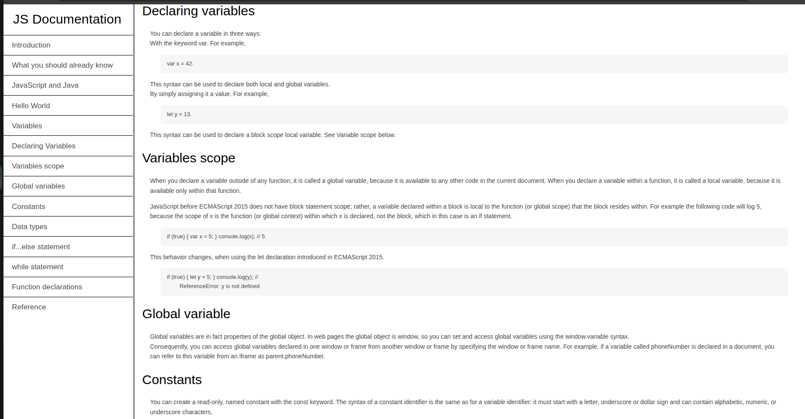

# JS Documentation

This is a technical JS documentation page created using **HTML** and **CSS** given by our teachers at **Rebase Code Camp**. The page explains JS documentation with bookmark reference. having a well example view.

---

## Preview and How to use
(open `index.html` or the deployed link to view the technical documentation)
- Deployed link: [https://kb-web237.github.io/technical-documentation/]

## Folder Structure
```text
.technicaldocweb
|___asssets/image/image.png
|___styles/index.css
|____index.html

```
## Example Output of the JS documentation


---

## Built with
- HTML
- CSS
- with IDE VS Code

---

## Features
- Clean and simple layout
- A clean design
- background image layout
- The survey form with the items to fill
- a message box

---

## Author
- Name: **KBrandN**
- Github: [https://github.com/KB-web237]

---

## Acknowledgements
- Inpiration from **Rebase Code Camp** and my teachers **Madam Faith and Vanessa**